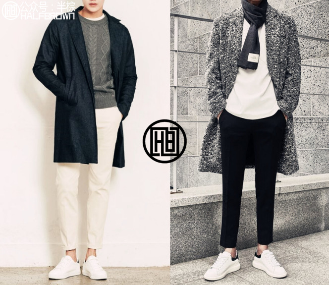

# 形象提升指导

### 认知自我

##### 穿衣风格

- 了解
  - **了解自己的性格特征点**
  - 每个人的性格特征点,每种特点会产生不一样的搭配感觉
    - **低调,闷骚,成熟:**
    - 颜色少,款型简单
    - 有时候时尚偏心机
    - 时尚的韩版西装
  - **了解自己的性格特征点,整合总结特征点,遵从内心,寻找与性格所匹配的搭配风格**
  - **了解自己的身型**
    - 了解自己身型的基本特征,优势和劣势,扬长避短
  - 了解自己当前所处的阶段: 当前阶段的搭配感觉
  - **每个年龄段有对应的穿衣感觉**
    - 上班族朝着简单舒适的方向落手
    - 颜色简单,款式简单舒适,处于轻熟状态即可
      
      - 管理层的服装可以偏商务感,选择西装,有视觉上的威严感
  - **了解自身身型的搭配雷区: 肤色, 身材**
    - 肤色:
    - 肤色偏黑
      - 不要选择颜色过于鲜亮的颜色: 白,红,黄,绿,蓝,紫等亮色系
    - 先搭配好黑色,再开始拓展搭配色系
  - 身型:
    - 偏矮
      - 上半身尽量买短款,让下半身尽量显长,上下比例四比六
    - 裤子尽量选择修身裤
    - 鞋子选择带跟的鞋子: 皮鞋,靴子等
    - 全身颜色搭配尽量简洁,走起路来尽量挺直身子
    - 穿高跟的鞋子: 工装靴, 马丁靴, 高帮鞋, 沙漠靴, 切尔西靴,雕花靴
  - **了解当前自己所处的阶段,了解自身的注意事项,学会取长补短,避开自己的劣势,发挥自己的优势**
  - **了解基础的搭配色彩**
    - 掌握好最原始基础的黑白灰:
    - 整体搭配要有黑白灰的层次区块感
    - 黑白灰真正的意义是: 暗色 + 亮色 + 过渡色 的层次感
    - 在黑白灰基础上增加大块的主题色:
      - 黑白灰作为搭配的基础色
    - 增加一大块色,搭配基础色的沉稳
    - 最基础的三种颜色的组合:
      - 黑主题色掌握好之后,尝试一些亮色调组合,三色系组合
    - 每三种颜色组合会产生不一样的感觉,自己多去尝试
  - **原则: 了解服装搭配的基础色黑白灰,整套的大块色不要超过三种颜色**
  - **了解当前主流风格:**
    - 了解学习主流风格: 韩系, 日系, 欧美.自己总结,寻找差别
  - 了解当前主流的搭配,款式,潮流走向,在了解的过程中,提高审美

### 学习

- **选择与性格,身型,向往相符的风格:**
  - 沉稳,闷骚,喜欢时尚: 走韩系搭配感觉,欧美的也穿,找到适合自己的风格
- **学习所选风格的具体搭配场景:**
  - 多学, 多看, 多试:
    - **学**
    - 向身边会穿着的同事和朋友学习
  - **看**
    - 关注一些向往风格的明星的穿着
    - 看到搭配好的人,记得在脑子里记录一下搭配的色调和款式
    - 多关注一些风格比较好的,纯正教搭配的自媒体
  - **试**
    - 多试试不同款式的衣服

### 实践

- **剪个清爽的发型:**
  - 发型清爽舒适即可
- **资源重复利用:**
  - 看以前的服装,怎么再次搭配
  - 把每天早上起床,挑衣服当作一次搭配练习
- **找到适合自己的品牌**

### 总结

- 总结自己的搭配风格
