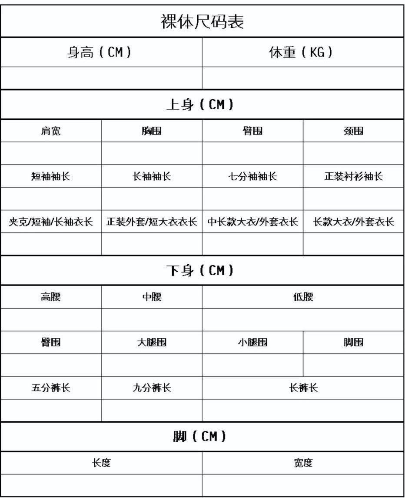
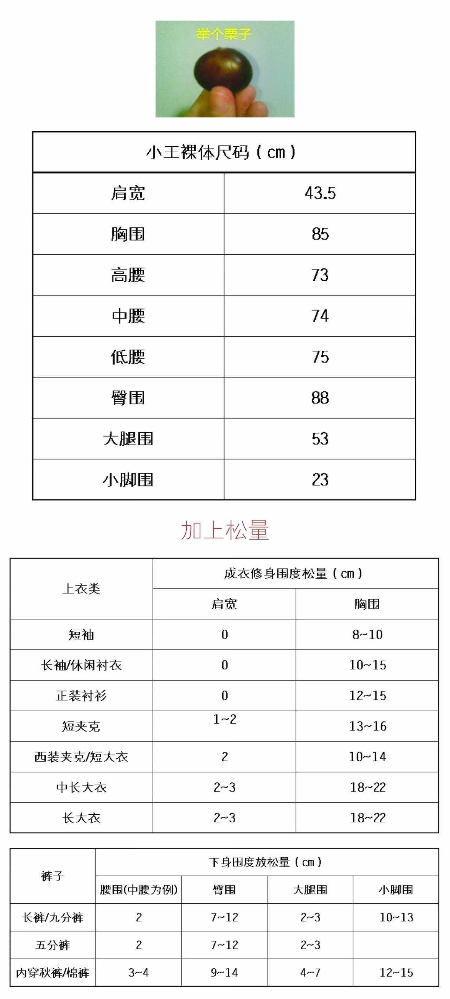
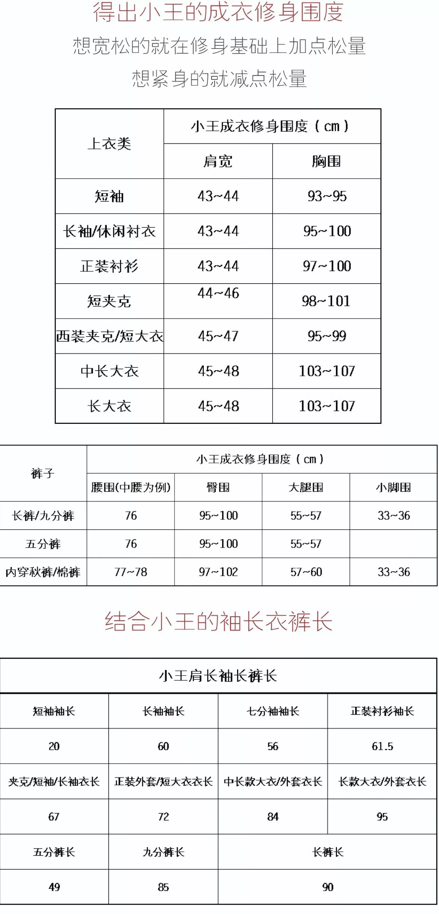

# 找准合身的衣服
- **尺码表:**

- **身高和体重:**
  - 身高 - 105 = 合适的体重
- **身高，体重，脚长:**
  - 上身：颈围，肩宽，胸围，上身长，臂长，臂围
  - 下身：腰围，臀围，大腿围，小腿围，下身长
- **身围:**
  - 裸身测量:
    - **颈围** - 绕喉结一周
	- **胸围** - 绕乳头一周
	- **肩宽** - 两个肩胛骨端点之间
	- **臂围** - 二头肌中间一周
	- **臀围** - 屁股中间一周
- **衬衫袖长:**
  - 休闲衬衫袖子长度盖住手腕就可以
  - 正装衬衫袖子长度要比西装袖子长
  - 衬衫系上所有扣子后脖领处要留一根手指头的长度
	- 衬衫的领口比西服外套高 1cm
	- 双手下垂,衬衫的袖口露出 1cm
- **皮鞋比运动鞋尺码大一码**
- **购买衣服**
  - 将裸体尺码和放松量相加
  - 结合袖长衣裤长
  - 对照店家尺寸购买
  
  
- **衣长不要超过身高的一半，穿成黄金比例**
- **身材不好的人穿长款大衣一定要把纽扣打开**

