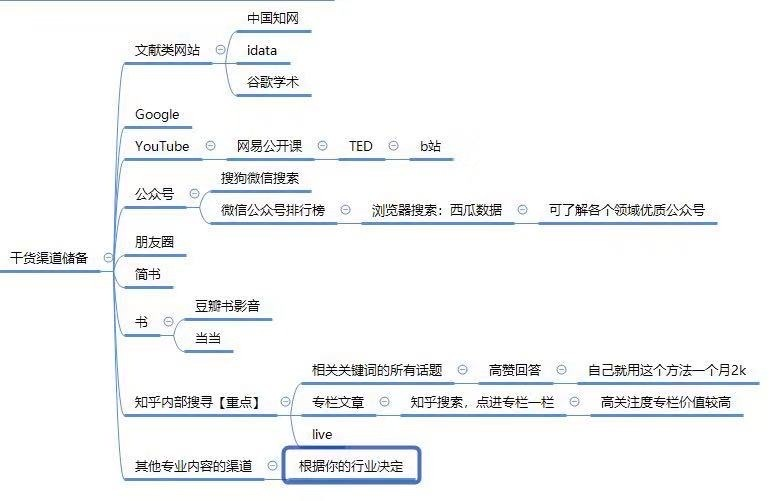

# 增加自己的知识储备
- 明确自己真正想要学习什么东西，就用心去学，真正行动起来。利用起各种碎片时间
- 学习到的知识，技能一定要把它们用起来，才能真正掌握。切勿只是学习一遍
- 先做正确的事，再正确的做事
- 学习渠道:

### 碎片化学习
- **信息 - 大脑解读(思维,判断) - 改变(认知,行为)**
##### 信息层面
- 缩小信息范围,解读并筛选有用的信息
- 带着问题去找有用的信息
  - 找到有营养的问题
  - 搜索该问题以及相关问题下的回答

