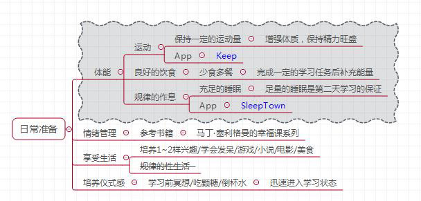
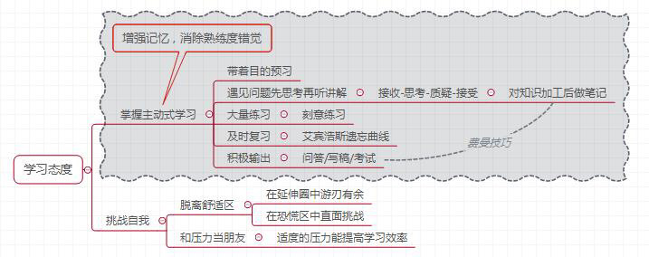
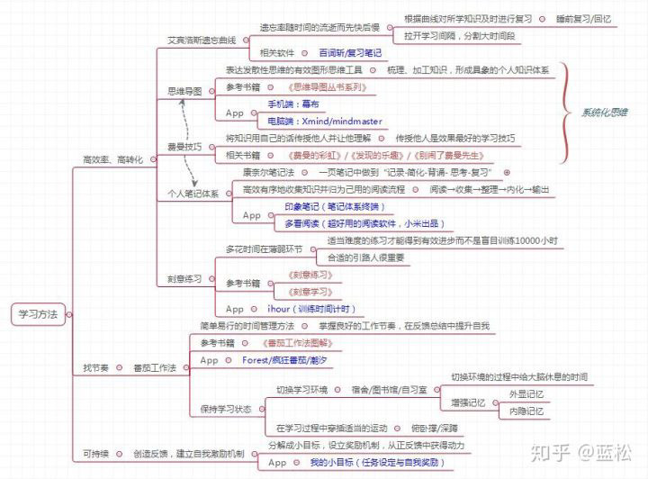
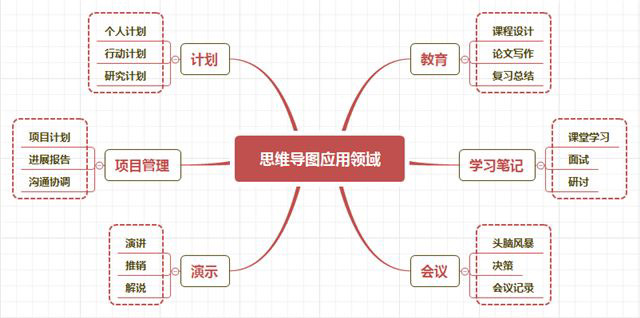

# 长时间高效学习
- 在完成一定工作量之后,停下来休息一下才是真正应该做的
- 长时间的高效学习: 有节奏,可持续,高效率,高转化的长期学习方式
- 要想保持高效学习: 就要保证体能充沛,情感舒畅,思想集中
- 日常准备:

- 每天保持运动,才能让自己在学习上保持良好的状态
- 一定要保证规律的作息,不仅仅是工作日,周末的作息也要保证
##### 控制情感和注意力
- 管理好自己的情绪,保持心态平和,才能顺利进入高效学习的状态
##### 端正学习态度

- **走出舒适区:**
  - **舒适区:** 技能熟练,环境熟悉,感觉舒适但是进步缓慢
  - **学习区:** 略有难度,需要学习,但是可以接受
  - **恐慌区:** 难度过大,在这个区域会感到恐惧和焦虑,难以承受
- 真正的强者能在学习区中游刃有余,在恐慌区直面挑战
##### 高效学习方法

- 制作思维导图:

- 建立个人笔记体系:
  - **阅读**
  - **收集**
  - **整理**
  - **内化**
  - **输出**
##### 刻意练习
- 在专注训练量的同时,还要注意到自己的训练目标
- 不断验证自己的训练成果并及时调整训练计划
- 不在低难度的训练中浪费时间,找到最合适自己的训练难度,得到最快速的成长
