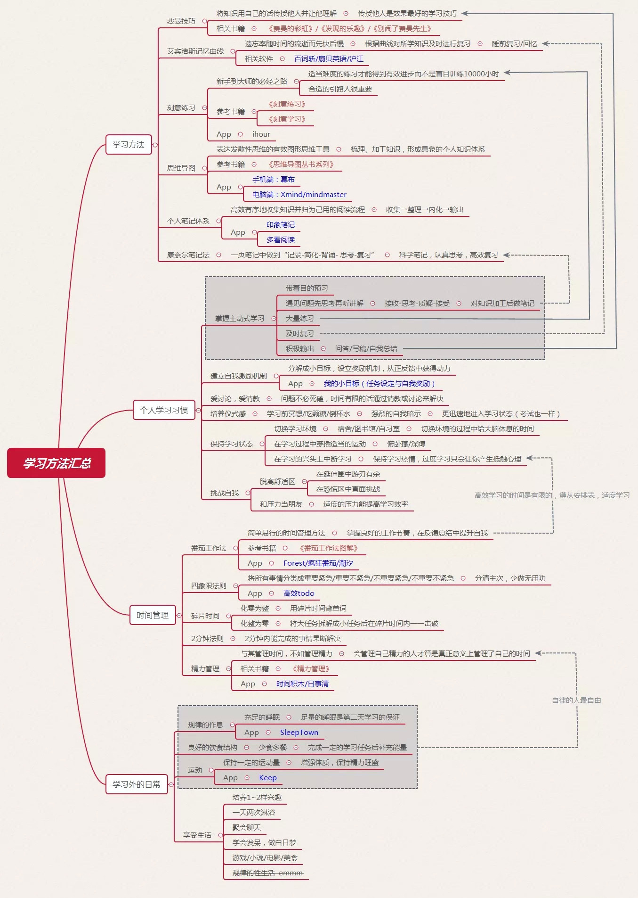

# 高效学习
- 进入学习的时间，就要真正有效地去学习。认真专注地学习起来。
- 遇到倦怠不想学的时候，无论怎样，都不要离开学习的环境，保持学习充斥周围。呆在只有学习的环境之中。
- 在你知道任务工作量和截止时间的时候，可以尝试着把一件任务分解到每天。每天匀出一点时间，用最认真投入把该做的任务做好。
- 学以致用，把学到的东西尽可能的去使用。
- 自己定下的计划不管如何都要执行下去。
- 把刚学到的东西，用自己的话，说出来
- 框架学习法：明确最近一段时间学习内容，只学习相关内容
  - **知识结构：包括基础，进阶，最高**
  - **知识模型：**
    - **5W2H：发现问题和解决问题**
	  - **选择目标：** What-这个知识对我有什么用，知识的重点是什么
	  - **选择原因：** Why-为什么这样理解，理由是什么，原因是什么
	  - **什么场合：** Where-掌握这个知识应该从哪里入手
	  - **什么时间：** When-什么时候学习最佳，未来什么时候能用到这个知识
	  - **什么人或组织：** Who-是否涉及到相关人或相关组织
	  - **如何提高效率：** How to do-怎么更高效地吸收知识，怎么将知识更进一步学习
	  - **性价比如何：** How much-这个知识的价值如何
					
  - **知识路径：分类-拓展-内化**
	- 分类：将每一类知识的重点，难点提炼出来，加深记忆
	- 拓展：同类知识学习
	- 内化：在日常中实际操作，加强记忆。把知识加上情感，利用场景加强记忆。横向比较，把知识的来龙去脉了解清楚，找到知识之间的联系
##### 体系化碎片式学习
- 一定要有一个具体的应用目标
- 建立知识体系框架
  - 从应用目标出发，分解出实现目标所需的知识，并组织成一个系统的框架
  - 构建出一个应用导向的知识体系
  - 碎片化输入，体系化积累
- 根据应用需要，将碎片化输入的内容，系统地填充在知识体系的位置上

