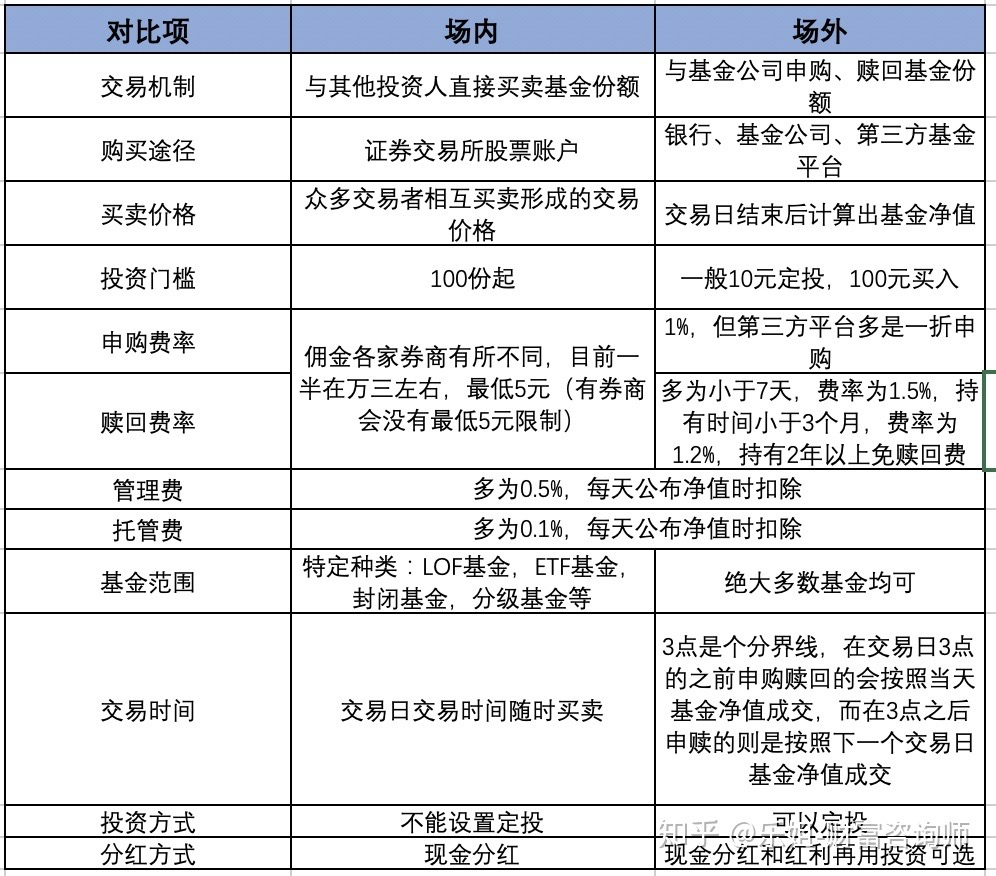

# 指数基金知识
### 场外基金
##### 基本概念
- **场外交易**
  - 指通过申购,赎回操作,和基金公司直接交易基金份额
  - 最常见的公募基金的交易形式,也叫一级交易市场
- 场外基金是和基金公司做交易,购买叫做申购,卖出叫做赎回
- 每个交易日收盘之后,基金公司会统计基金总资产,除以份额,得到基金净值,然后把这个基金净值公布出来.每份基金的多少钱,就是指的这个基金净值
- **申购:**
  - 如果在收盘之前向基金公司申购:
	- 按照交易日当天T日公布的基金净值来计算你买入了多少份额
	- T+1日就能看到账户确认的份额
  - 如果在收盘之后才申购的,就会算到下一个交易日:
	- 按照T+1日公布的基金净值来计算份额
	- T+2日确认份额
- **赎回:**
  - 交易日下午3点前收盘前赎回:
    - 基金净值在收盘后才会公布
	- 所以要到T+1日确认赎回的金额
  - 交易日下午3点之后赎回:
	- 按照T+1日基金净值计算
	- T+2日确认赎回的金额
- 申购和赎回时要特别注意周末及节假日:
  - 交易日:
    - 非节假日的周一至周五
  - 交易时间:
	- 上午: 9:30 - 11:30
	- 下午: 13:00 - 15:00
  - 在周五或者节假日最后一天收盘前才发出申购或赎回指令,那么T+1日,也就是要等到下周一或节假日过完后的第一个交易日才能确认份额或金额,中间这段天不会产生任何收益,就白白浪费了
- **场外交易渠道:**
  - 第三方平台:
	- 天天基金网
	- 蚂蚁财富
### 场内基金
- 场内交易,也就是基金所交易. 通过证券账户.可以和其他投资人在二级市场上互相买卖一部分基金类型的基金. 买卖价格既受生产成本的影响,同时也要看双方的交易意愿
- 这个时候买基金叫做买入,买基金叫做卖出
- 在买卖的时候,不需要像场外基金一样,等净值公布后确认份额,而是按照当时的交易价格即时成交
- 这个交易价格通常会围绕着基金净值波动,买入成交了马上份额会到手上. 卖出成交了马上就能看到卖出的资金到账.
- 买卖收一个手续交易费即可,手续费最低可以到万分之一,比场外基金便宜不少
### 场外基金和场内基金比较

- 场内基金: 一般是 **159xxx** 开头,或者是**510xxx**开头
- 场外基金 **: 一般非159或510开头**
### 场外基金和场内基金如何选择
- **买得到:**
  - 场外基金种类丰富,选择多
  - 场内基金只有特定的种类,选择少
- **省钱:**
  - 根据交易金额,分别计算场外基金和场内基金的费用,相互比对
  - 一般资金量大的时候场外基金比场内基金的交易费用要高
- **省时省力:**
  - 看看在哪里买更方便,更适合自己
  - 场外基金可以自动定投,但是场内不支持
- **场内外差价:**
  - 在场外基金暂停申购的特殊情况下,场内基金购买是一种不错的替代方法
  - 注意规避场内基金和场外基金差异过大的风险,避免遭受损失
### 操作建议
- **先从场外基金入手**
  - 操作方便快捷:
	- 可以一键设置定投,每月自动扣款
	- 按基金收盘净值成交:
  - 交易日以净值成交,不用像场内看价格实时波动,有助于稳定心态
