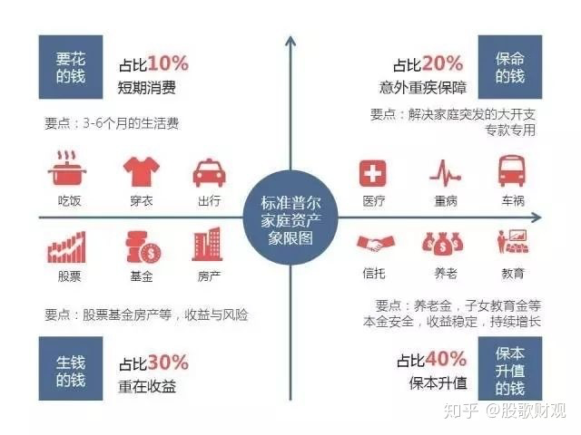

# 理财知识
- 需要有筹谋全局,机智善辩的智商,需要察言观色,为人处世的情商,需要精打细算,时刻为自己未来财富做未雨绸缪的财商
### 掌握自己的收支
- 每月20号后的第一个周末,看一下自己的收支情况
- 去记账,优化自己的开支
- 尽可能在不降低生活品质的情况下,节省自己的开支
### 每月定存
### 增强消费的计划性:
- 有计划的进行消费
### 不要买可有可无的产品
### 资产分配

### 保险
1. 配置医疗险
2. 重疾险
3. 意外险
4. 寿险
- 保险配置是专业性很强的事情,要根据自己的实际需求和预算来选择合理的产品
- 对个人的身体状况,职业,年龄都会有一定的要求
- 自己配置保险,在不具备专业保险知识的情况下,配置保险需要咨询专业的保险顾问,定制适合自己的方案

